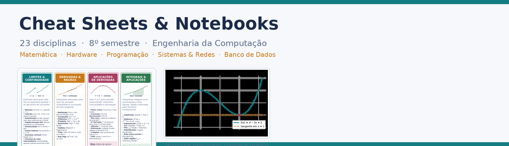

# 🎓 Engenharia da Computação — Cheat Sheets & Notebooks

> **Portfólio de estudos** — Resumos visuais (cheat sheets em PDF) + notebooks Jupyter executáveis, cobrindo as principais disciplinas do curso.


---

## 🧭 O que é este repositório

Este repositório reúne **23 disciplinas de Engenharia da Computação** em um formato de estudo duplo:

| Formato | Descrição |
|---|---|
| 📄 **Cheat Sheet (PDF)** | Resumo visual estilo *OneNote*, com cards coloridos por tópico, fórmulas, diagramas e dicas — gerado com `reportlab`. |
| 📓 **Notebook Jupyter (.ipynb)** | A mesma matéria com **explicação em Markdown + código Python executável + saída real** (resultados numéricos, simulações e gráficos). |

> 🎯 **Objetivo:** qualquer pessoa que acesse o repositório consegue **ver a lógica e o resultado da execução** — sem precisar instalar nada para visualizar, e com um `pip install` para reproduzir.

---

## 📸 Demonstração

<!-- ============================================================
     📸 TODO: COLOQUE AQUI O PRINT/GIF DO SEU PRINCIPAL EXEMPLO
     Coloque a imagem em: assets/demo.gif  (ou assets/demo.png)
     Exemplo:
     
============================================================ -->

<p align="center">
  
  <br/>
  <em>⬆️ Substitua <code>assets/demo.png</code> por um <b>print ou GIF</b> dos notebooks rodando (ex.: Jupyter com gráficos e cheat sheet gerado).</em>
</p>

---

## 🗂️ Estrutura do repositório

```
├── notebooks/                     # 📓 Jupyter Notebooks (executados, com saídas embutidas)
│   ├── 01_Matematica_e_Ciencias/  #   6 disciplinas
│   ├── 02_Hardware/               #   4 disciplinas
│   ├── 03_Programacao/            #   9 disciplinas
│   ├── 04_Sistemas_e_Redes/       #   2 disciplinas
│   └── 05_Banco_de_Dados/         #   2 disciplinas
├── outputs/                       # 📄 Cheat sheets em PDF gerados
├── src/                           # ⚙️ Scripts geradores originais das matérias
├── assets/                        # 🖼️ Imagens, prints e GIFs (demonstrações)
├── tools/                         # 🔧 Pipeline automático de build dos notebooks
├── requirements.txt
└── README.md
```

---

## 📚 Disciplinas por categoria

### 🔬 Matemática & Ciências

<!-- 📸 TODO: adicionar print do notebook rodando (ex.: assets/mat/codigo_rodando.png) -->

| Disciplina | Notebook | Cheat Sheet |
|---|---:|---:|
| Cálculo Diferencial e Integral I | [📓 Abrir](notebooks/01_Matematica_e_Ciencias/Calculo_Diferencial_Integral_I.ipynb) | [📄 PDF](outputs/Calculo_Diferencial_Integral_I.pdf) |
| Cálculo II | [📓 Abrir](notebooks/01_Matematica_e_Ciencias/Calculo_II.ipynb) | [📄 PDF](outputs/Calculo_II.pdf) |
| Métodos Matemáticos | [📓 Abrir](notebooks/01_Matematica_e_Ciencias/Metodos_Matematicos.ipynb) | [📄 PDF](outputs/Metodos_Matematicos.pdf) |
| Física Geral Experimental — Mecânica & Energia | [📓 Abrir](notebooks/01_Matematica_e_Ciencias/Fisica_Geral_Experimental_Mecanica_Energia.ipynb) | [📄 PDF](outputs/Fisica_Geral_Experimental_Mecanica_Energia.pdf) |
| Princípios de Eletricidade e Magnetismo | [📓 Abrir](notebooks/01_Matematica_e_Ciencias/Principios_Eletricidade_Magnetismo.ipynb) | [📄 PDF](outputs/Principios_Eletricidade_Magnetismo.pdf) |
| Resistência dos Materiais | [📓 Abrir](notebooks/01_Matematica_e_Ciencias/Resistencia_dos_Materiais.ipynb) | [📄 PDF](outputs/Resistencia_dos_Materiais.pdf) |

### 💻 Hardware

<!-- 📸 TODO: adicionar print do notebook rodando (ex.: assets/hardware/codigo_rodando.png) -->

| Disciplina | Notebook | Cheat Sheet |
|---|---:|---:|
| Arquitetura e Organização de Computadores | [📓 Abrir](notebooks/02_Hardware/Arquitetura_Organizacao_Computadores.ipynb) | [📄 PDF](outputs/Arquitetura_Organizacao_Computadores.pdf) |
| Arquiteturas Paralelas e Distribuídas | [📓 Abrir](notebooks/02_Hardware/Arquiteturas_Paralelas_Distribuidas.ipynb) | [📄 PDF](outputs/Arquiteturas_Paralelas_Distribuidas.pdf) |
| Circuitos Elétricos | [📓 Abrir](notebooks/02_Hardware/Circuitos_Eletricos.ipynb) | [📄 PDF](outputs/Circuitos_Eletricos.pdf) |
| Eletrônica Analógica | [📓 Abrir](notebooks/02_Hardware/Eletronica_Analogica.ipynb) | [📄 PDF](outputs/Eletronica_Analogica.pdf) |

### 🧩 Programação

<!-- 📸 TODO: adicionar GIF dos exemplos de IA/gRáficos rodando (ex.: assets/prog/ia_treinando.gif) -->

| Disciplina | Notebook | Cheat Sheet |
|---|---:|---:|
| Algoritmos e Lógica de Programação | [📓 Abrir](notebooks/03_Programacao/Algoritmos_Logica_Programacao.ipynb) | [📄 PDF](outputs/Algoritmos_Logica_Programacao.pdf) |
| Algoritmos e Estruturas de Dados | [📓 Abrir](notebooks/03_Programacao/Algoritmos_Estrutura_Dados.ipynb) | [📄 PDF](outputs/Algoritmos_Estrutura_Dados.pdf) |
| Algoritmos e Estruturas de Dados Avançado | [📓 Abrir](notebooks/03_Programacao/Algoritmos_Estrutura_Dados_Avancado.ipynb) | [📄 PDF](outputs/Algoritmos_Estrutura_Dados_Avancado.pdf) |
| Linguagem Orientada a Objetos | [📓 Abrir](notebooks/03_Programacao/Linguagem_Orientada_a_Objetos.ipynb) | [📄 PDF](outputs/Linguagem_Orientada_a_Objetos.pdf) |
| Desenvolvimento em JavaScript | [📓 Abrir](notebooks/03_Programacao/Desenvolvimento_em_Javascript.ipynb) | [📄 PDF](outputs/Desenvolvimento_em_Javascript.pdf) |
| Engenharia de Software | [📓 Abrir](notebooks/03_Programacao/Engenharia_de_Software.ipynb) | [📄 PDF](outputs/Engenharia_de_Software.pdf) |
| Computação Gráfica e Processamento de Imagens | [📓 Abrir](notebooks/03_Programacao/Computacao_Grafica_Processamento_Imagens.ipynb) | [📄 PDF](outputs/Computacao_Grafica_Processamento_Imagens.pdf) |
| Fundamentos de Inteligência Artificial | [📓 Abrir](notebooks/03_Programacao/Fundamentos_Inteligencia_Artificial.ipynb) | [📄 PDF](outputs/Fundamentos_Inteligencia_Artificial.pdf) |
| Design Thinking, Inovação e Modelos de Negócios | [📓 Abrir](notebooks/03_Programacao/Design_Thinking_Inovacao_Modelos_Negocios.ipynb) | [📄 PDF](outputs/Design_Thinking_Inovacao_Modelos_Negocios.pdf) |

### 🖧 Sistemas & Redes

<!-- 📸 TODO: adicionar print do notebook rodando (ex.: assets/sistemas/codigo_rodando.png) -->

| Disciplina | Notebook | Cheat Sheet |
|---|---:|---:|
| Sistemas Operacionais | [📓 Abrir](notebooks/04_Sistemas_e_Redes/Sistemas_Operacionais.ipynb) | [📄 PDF](outputs/Sistemas_Operacionais.pdf) |
| Redes de Computadores | [📓 Abrir](notebooks/04_Sistemas_e_Redes/Redes_de_Computadores.ipynb) | [📄 PDF](outputs/Redes_de_Computadores.pdf) |

### 🗄️ Banco de Dados

<!-- 📸 TODO: adicionar GIF de consulta SQL rodando (ex.: assets/db/consulta_sql.gif) -->

| Disciplina | Notebook | Cheat Sheet |
|---|---:|---:|
| Modelagem de Dados | [📓 Abrir](notebooks/05_Banco_de_Dados/Modelagem_de_Dados.ipynb) | [📄 PDF](outputs/Modelagem_de_Dados.pdf) |
| Programação em Banco de Dados | [📓 Abrir](notebooks/05_Banco_de_Dados/Programacao_Banco_de_Dados.ipynb) | [📄 PDF](outputs/Programacao_Banco_de_Dados.pdf) |

---

## 🚀 Como usar

### Visualizar (sem instalar nada)
- Os notebooks são **renderizados diretamente no GitHub** — abra qualquer arquivo `.ipynb` e veja o código **e** a saída.
- Os PDFs estão prontos em `outputs/`.

### Reproduzir localmente

```bash
# 1. Clone o repositório
git clone <seu-repositorio>.git

# 2. Crie um ambiente virtual (recomendado)
python -m venv .venv
.venv\Scripts\activate        # Windows
source .venv/bin/activate     # Linux/macOS

# 3. Instale as dependências
pip install -r requirements.txt

# 4. Abra um notebook
jupyter notebook notebooks/01_Matematica_e_Ciencias/Calculo_Diferencial_Integral_I.ipynb
```

> 💡 Os notebooks já vêm **pré-executados**: as saídas estão embutidas. Para reproduzir, basta `Cell → Run All`.

---

## 🛠️ Tecnologias utilizadas

| Biblioteca | Uso |
|---|---|
| [reportlab](https://www.reportlab.com/) | Geração dos cheat sheets em PDF |
| [matplotlib](https://matplotlib.org/) | Gráficos e visualizações |
| [numpy](https://numpy.org/) | Cálculo numérico e simulações |
| [scipy](https://scipy.org/) | Equações diferenciais e ferramentas científicas |
| [sympy](https://www.sympy.org/) | Matemática simbólica (limites, derivadas, integrais) |
| [pymupdf](https://pymupdf.readthedocs.io/) | Renderização do PDF dentro do notebook |
| [sqlite3](https://docs.python.org/3/library/sqlite3.html) | Exemplos práticos de banco de dados |

> 🪄 **Cross-platform:** os geradores resolvem as fontes automaticamente (a DejaVu embarcada no `matplotlib` é usada como fallback), então rodam em **Windows, Linux e macOS** sem ajustes.

---

## 🖼️ Onde inserir seus prints/GIFs

> Os marcadores `<!-- 📸 TODO: ... -->` espalhados neste README e dentro de cada notebook indicam exatamente onde colocar as evidências visuais do código rodando. Siga a convenção de pastas:

```
assets/
├── demo.png                     # banner principal do README
├── mat/                         # prints da categoria Matemática & Ciências
├── hardware/
├── prog/                        # GIFs (ex.: IA treinando, gráficos)
├── sistemas/
└── db/                          # GIFs (ex.: consulta SQL)
```

**Sugestão de capturas:**
1. 🧮 Notebook de Cálculo com a reta tangente e a integral resolvida.
2. 🤖 Notebook de IA com o perceptron/regressão e o gráfico de ajuste.
3. 🗄️ Notebook de Banco de Dados com o resultado do `JOIN`.
4. 🖥️ Notebook de Circuitos com o transitório RC e os fasores.
5. 📄 Um cheat sheet PDF aberto (o resultado final do gerador).

---

## 🔄 Regenerar tudo (para manter o repositório)

Se você editar o conteúdo dos geradores em `src/`, pode reconstruir todos os notebooks com:

```bash
python tools/build_notebooks.py
```

O script lê os geradores em `src/`, transforma-os em versões portáveis (fontes resolvidas automaticamente), executa cada notebook (embutindo as saídas) e copia os PDFs para `outputs/`.

---

## 📌 Roadmap

- [x] 23 disciplinas convertidas em notebooks executáveis
- [x] Cheat sheets em PDF cross-platform
- [x] README com categorias e demonstrações
- [ ] Adicionar prints/GIFs de demonstração
- [ ] Criar GitHub Actions para CI (rodar notebooks automaticamente)
- [ ] Tradução EN do conteúdo teórico

---

## 📄 Licença

Distribuído sob a licença **MIT**. Veja o arquivo [LICENSE](LICENSE) para mais detalhes.

---

<p align="center">
  Feito com 💙 para <b>Engenharia da Computação</b>.
</p>